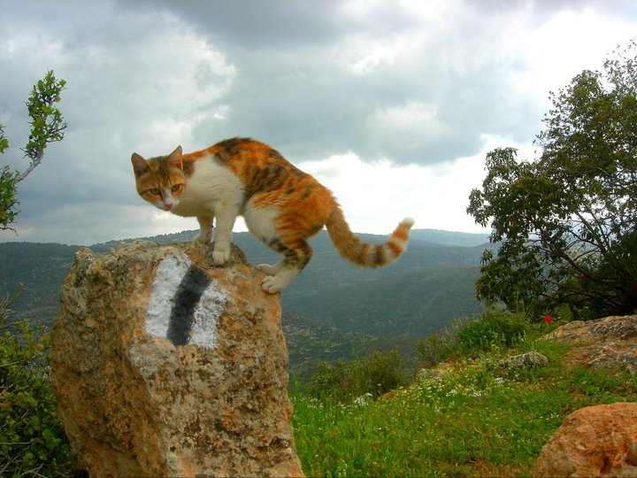
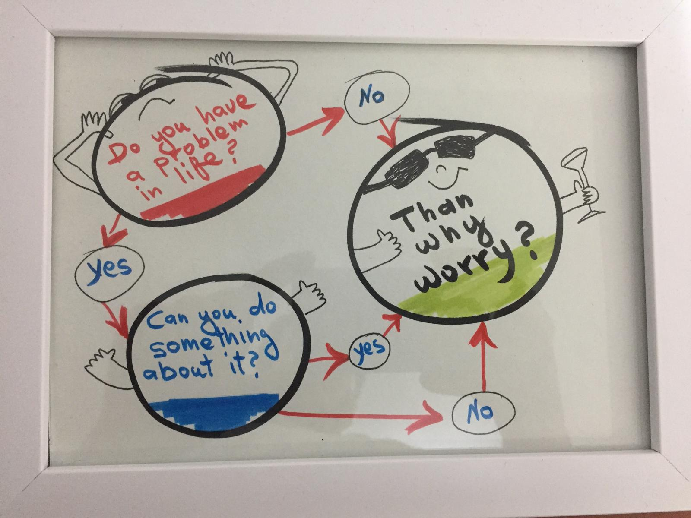

 

# Staying on top of  things
I found myself in the middle of the Judean desert at night without any light, sitting on the top of one of the hills. 

30 minutes earlier, the tour guide advised us to avoid walking in the wadi, so we won't get stuck in the dark. I was in 9th grade. Up to that point, I really enjoyed the trip. Unfortunately, the tour guide didn't plan the trip very well. Him, his six years old twins, half of the group and I were stuck for 4 hours until the rescue team arrived. At that point I realized that leading people forward to the goal isn't as easy as it seems. 

## Be effective

One of the things I've been trying to implement over the past year is solving the problems I met on that trip. The first problem was a lack of preparation and the second one was a lack of effective tools. I will focus on the second problem in the following lines. 

The tour guide wasn't really familiar with the trail, so he needed to stop every hundred metres and open his map to make sure we were on the right path. He waited for the whole group at that spot and continued moving only after everyone came.  As the sun began to set, he realized that it was taking too long, so he decided to set his children as landmarks so he could move on.

Back to technology challenges, during the past year I understood that I have great and effective tools such as REST API which enables me to interact with our inner tracking systems such as Trello, Jira and Github. 

> “The most effective way to do it, is to do it.”   (Amelia Earhart)

During my first month as a team leader I realized I'm losing too much time trying to understand the status of the on-going tasks, finding pull requests on Github and so on. Even though some of the tracking systems have reports mechanism, it didn't fit all my needs, so I started implementing a short Python scripts that increased my productivity:

### Github
At my day to day work I search for my team pull requests, enjoying seeing their amazing work while drinking my coffee in the morning. Forthmore, some of the pull requests demand my review and it helps me make sure I’m not missing any request. After a while I deduced that in common projects the owner needs to understand  what the changes were inserted to the code base by different users, and can track it. These requirements were implemented [here](https://github.com/shmargadt/mgr-tools/tree/master/github).

### Trello
In order to be on top of things you must know the status of the current features for the upcoming release. In order for the team and the external stakeholders to be on the same page, I exported the status to a csv file. These requirements were implemented [here](https://github.com/shmargadt/mgr-tools/tree/master/trello)

### Jira
[Coming soon...](https://github.com/shmargadt/mgr-tools/tree/master/jira) 
 

> “The human race has one really effective weapon, and that is laughter.” (Mark Twain)

One thing I can’t forget - the joyfulness of the bus driver. When the tour guide understood we were stuck he called the bus driver, who was a really nice person and he started to laugh. He laughed every time we called that night,  although it was a very difficult situation and we were struggling to get cellular reception to give directions to the rescue team. During the past year I looked more than once on a diagram that help me go through the stress and challenges, and I hope this tool will stay in my bag for years: 

 

##### Useful links:
- My tools for effectives - https://github.com/shmargadt/mgr-tools/
- Do You Have Problems In Your Life / Gaur Gopal Das - https://www.youtube.com/watch?v=Z678escg5Q8

